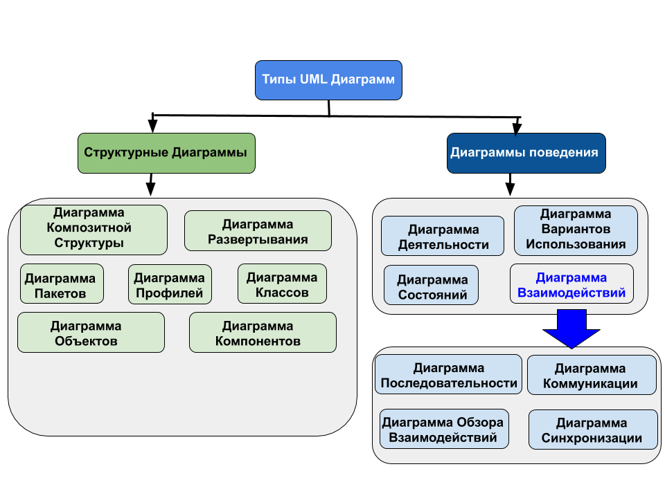
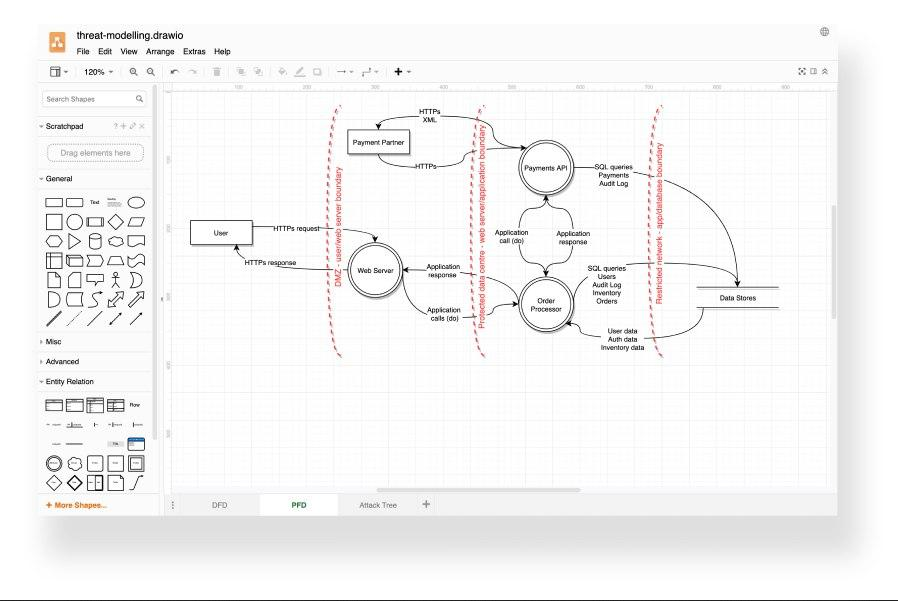
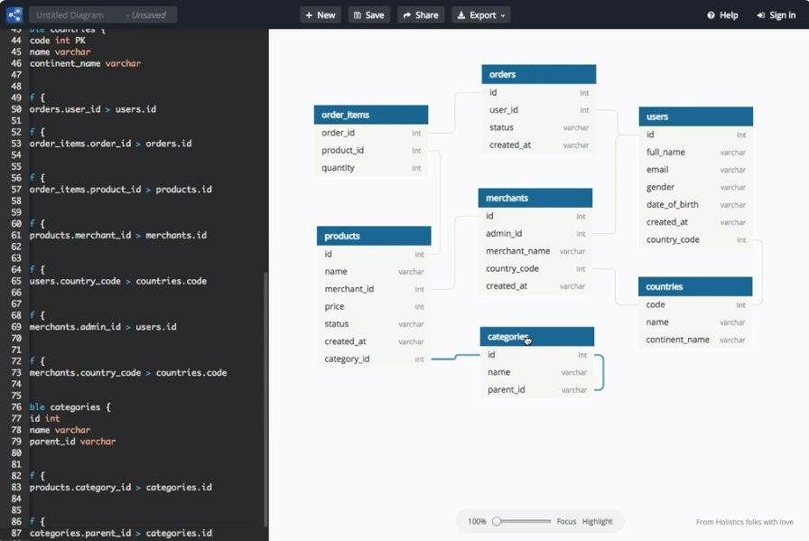
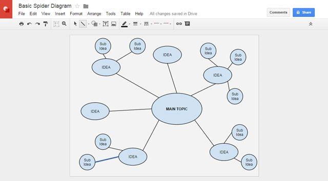
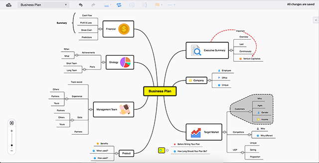

# UML диаграммы

1.  [Что такое UML-диаграммы?](#что-такое-uml-диаграммы) 
  - [Основные цели](#основные-цели)
  - [Плюсы и минусы UML проектирования](#плюсы-и-минусы-uml-проектирования)
    - [Плюсы UML проектирования](#плюсы-uml-проектирования)
    - [Минусы UML проектирования](#минусы-uml-проектирования) 
2.  [Для чего используется UML?](#для-чего-используется-uml) 
  - [Варианты использования диаграмм](#варианты-использования-диаграмм)
3.  [Виды UML-диаграмм](#виды-uml-диаграмм)
  - [Поведенческие диаграммы UML](#поведенческие-диаграммы-uml)
    - [Диаграмма деятельности](#диаграмма-деятельности)
    - [Диаграмма прецедентов](#диаграмма-прецедентов)
    - [Диаграмма состояний](#диаграмма-состояний)
    - [Диаграмма последовательности](#диаграмма-последовательности)
    - [Диаграмма коммуникаций](#диаграмма-коммуникаций)
    - [Диаграмма обзора взаимодействия](#диаграмма-обзора-взаимодействия)
    - [Временная диаграмма](#временная-диаграмма)
  - [Структурные диаграммы UML](#структурные-диаграммы-uml)
    - [Диаграмма композитной структуры](#диаграмма-композитной-структуры)
    - [Диаграмма развертывания](#диаграмма-развертывания)
    - [Диаграмма пакетов](#диаграмма-пакетов)
    - [Диаграмма профилей](#диаграмма-профилей)
    - [Диаграмма классов](#диаграмма-классов)
    - [Диаграмма объектов](#диаграмма-объектов)
    - [Диаграмма компонентов](#диаграмма-компонентов)
  
4.  [Программы для создания диаграмм](#программы-для-создания-диаграмм) 
  - [Diagrams.net](#diagramsnet)
  - [Dbdiagram.io](#dbdiagramio)
  - [Google Drawings](#google-drawings)
  - [xmind.net](#xmindnet)

## Что такое UML-диаграммы?
> **Unified Modeling Language** (**UML**) — унифицированный язык моделирования.

Расшифруем: **modeling** подразумевает создание модели, описывающей объект. **Unified** (универсальный, единый) — подходит для широкого класса проектируемых программных систем, различных областей приложений, типов организаций, уровней компетентности, размеров проектов. UML описывает объект в едином заданном синтаксисе, поэтому где бы вы не нарисовали диаграмму, ее правила будут понятны для всех, кто знаком с этим графическим языком — даже в другой стране.
### Основные цели
  - Предоставить пользователям готовый, выразительный язык визуального моделирования, чтобы они могли разрабатывать и обмениваться осмысленными моделями.
  - Обеспечить механизмы расширяемости и специализации для расширения основных понятий.
  - Быть независимым от конкретных языков программирования и процессов разработки.
  - Обеспечить формальную основу для понимания языка моделирования.
  - Поощрять рост рынка объектно-ориентированных инструментов.
  - Поддержка высокоуровневых концепций разработки, таких как совместная работа, структуры, шаблоны и компоненты.
  - Интегрировать лучшие практики.

### Плюсы и минусы UML проектирования
Для того, чтобы разобраться, нужно ли именно вам использовать UML, необходимо рассмотреть основные диаграммы. 
Благодаря им складывается общая картина, дающая представление о возможностях выражения архитектурных идей в рамках бизнес-задач. 

#### Плюсы UML проектирования
  - Возможность посмотреть на задачу с разных точек зрения;
  - Другим программистам легче понять суть задачи и способ ее реализации;
  - Диаграммы сравнительно просты для чтения после достаточно быстрого ознакомления с их синтаксисом.

#### Минусы UML проектирования
  + Трата времени;
  + Необходимость знания различных диаграмм и их нотаций.    

## Для чего используется UML?
> Одна из задач UML — служить **средством коммуникации** внутри команды и при общении с заказчиком.
### Варианты использования диаграмм
1. **Проектирование**. UML-диаграммы помогут при моделировании архитектуры больших проектов, в которой можно собрать как крупные, так и более мелкие детали и нарисовать каркас (схему) приложения. По нему впоследствии будет строиться код.  
2. **Реверс-инжиниринг** — создание UML-модели из существующего кода приложения, обратное построение. Может применяться, например, на проектах поддержки, где есть написанный код, но документация неполная или отсутствует.
3. Из моделей можно извлекать текстовую информацию и генерировать относительно удобочитаемые тексты — **документировать**. Текст и графика будут дополнять друг друга.

 
Все представленные ниже диаграммы связаны между собой. Комбинируя их, мы можем добиться необходимого уровня декомпозиции отдельно взятых задач. 

## Виды UML-диаграмм
> Диаграммы UML подразделяют на два типа — это структурные диаграммы и диаграммы поведения.

### Поведенческие диаграммы UML
> **Диаграммы поведения** показывают динамическое поведение объектов в системе, которое можно описать, как серию изменений в системе с течением времени. Также существует семь типов диаграмм поведения.
#### Диаграмма деятельности
  Диаграммы деятельности (или, как часто говорят, диаграмма активности) можно использовать на всех этапах разработки программного обеспечения и для различных целей.  И поскольку они очень похожи на  блок-схемы, они обычно более популярны, чем другие типы диаграмм UML

Активность Диаграммы с Swimlanes.
 

В Диаграммы деятельности *Swimlanes* – также известные как разделы – используются для представления или группирования действий, 
выполняемых различными действующими лицами в одном потоке. Вот несколько советов, вы можете следовать при использовании *Swimlanes*.

+ Добавить Swimlanes линейных процессов. Это позволяет легко читать.
+ Не добавляйте более 5 Swimlanes.
+ Расположить Swimlanes в логическом порядке.

 
В UML указан набор символов и правил для построения диаграмм активности. Ниже приведены часто используемые символы диаграммы деятельности с пояснениями.
 
<html>
<table style="padding:10px">
  <tr>
    <td valign="top" align="center"> <strong>Символ</strong> </td>
    <td valign="top" align="center"><strong>Имя</strong></td>
    <td valign="top" align="center"><strong>Использовать</strong></td>
  <tr/>
  <tr>
    <td></td>
    <td valign="top" align="center">Пуск / начальный узел</td>
    <td valign="top" align="center">Используется для представления отправной точки или начального состояния деятельности</td>
  <tr/>
  <tr>
    <td></td>
    <td valign="top" align="center">Действие / Состояние действия</td>
    <td valign="top" align="center">Используется для представления деятельности процесса</td>
  <tr/>
  <tr>
    <td></td>
    <td valign="top" align="center">Действие</td>
    <td valign="top" align="center">Используется для представления исполняемых подрайонов деятельности</td>
  <tr/>
  <tr>
    <td></td>
    <td valign="top" align="center">Поток управления / Край</td>
    <td valign="top" align="center">Используется для представления потока управления от одного действия к другому</td>
  <tr/>
  <tr>
    <td></td>
    <td valign="top" align="center">Поток объекта / края управления</td>
    <td valign="top" align="center">Используется для отображения пути движения объектов по активности</td>
  <tr/>
  <tr>
    <td></td>
    <td valign="top" align="center">Конечный узел активности</td>
    <td valign="top" align="center">Используется для обозначения конца всех контрольных потоков в рамках деятельности</td>
  <tr/>
  <tr>
    <td></td>
    <td valign="top" align="center">Поток конечный узел</td>
    <td valign="top" align="center">Используется для обозначения конца одного потока управления</td>
  <tr/>
  <tr>
    <td></td>
    <td valign="top" align="center">Узел принятия решений</td>
    <td valign="top" align="center">Используется для представления условной точки ответвления с одним входом и несколькими выходами</td>
  <tr/>
  <tr>
    <td></td>
    <td valign="top" align="center">Узел слияния</td>
    <td valign="top" align="center">Используется для представления слияния потоков. Он имеет несколько входов, но один выход.</td>
  <tr/>
  <tr>
    <td></td>
    <td valign="top" align="center">Вилка</td>
    <td valign="top" align="center">Используется для представления потока, который может разветвляться на два и более параллельных потока</td>
  <tr/>
   <tr>
    <td></td>
    <td valign="top" align="center">Слияние</td>
    <td valign="top" align="center">Используется для представления двух входов, которые объединяются в один выход</td>
  <tr/>
  <tr>
    <td></td>
    <td valign="top" align="center">Отправка сигнала</td>
    <td valign="top" align="center">Используется для представления действия по отправке сигнала на приемную деятельность</td>
  <tr/> 
   <tr>
    <td></td>
    <td valign="top" align="center">Получение сигнала</td>
    <td valign="top" align="center">Используется для обозначения того, что сигнал получен</td>
  <tr/>
  <tr>
    <td></td>
    <td valign="top" align="center">Примечание / комментарий</td>
    <td valign="top" align="center">Используется для добавления соответствующих комментариев к элементам</td>
  <tr/>
</table>
  </html>
 

**Как нарисовать диаграмму деятельности?**
 
 
Схемы деятельности могут быть использованы для моделирования бизнес-требований, создания высокоуровневого представления о функциональных возможностях системы, анализа сценариев использования и для различных других целей.   В каждом из этих случаев, вот как нарисовать диаграмму активности с самого начала.

**Шаг 1: Определите шаги действия по сценарию использования**

Здесь вам необходимо определить различные виды деятельности и действия, из которых состоит ваш бизнес-процесс или система.

**Шаг 2: Определите участвующих субъектов**

Если вы уже выяснили, кто эти актеры, то легче разобраться в каждом действии, за которое они отвечают.

**Шаг 3: Найти поток среди мероприятий**

Выяснить, в каком порядке обрабатываются действия. Отметьте условия, которые должны быть выполнены для выполнения определенных процессов, какие действия происходят одновременно, и нужно ли добавлять какие-то ветки на диаграмме. И вы должны завершить некоторые действия, прежде чем вы можете перейти к другим?

**Шаг 4: Добавить Swimlanes**

Вы уже выяснили, кто отвечает за каждое действие. Теперь пришло время, чтобы назначить им Swimlane и группу каждое действие они несут ответственность за под ними.

**Диаграмма деятельности Примеры**
+ Хороший пример  

+ Плохой пример  

  -   Начальный узел должен иметь исходящее ребро, идущее к **Login**, если бы этого не было, можно было бы понять, что ничего никогда не произойдет, лучше избегать двусмысленности.
  -   **Confirm placement seekers** форма имеет два исходящих ребра. Это не является незаконным, но только одна цель может принять ее одновременно, и семантика UML не определяет, какая именно. Если вы хотите, чтобы выполнялись оба целевых действия, вы должны добавить узел ответвления (а затем узел соединения для синхронизации параллельных потоков). Если вам нужен только один, избегайте двусмысленности, используя промежуточный узел решения.
  -   **Receive confirmation notification** не имеет исходящего края. Это не является незаконным и похоже на конечную ситуацию потока. Тем не менее это могло бы вызвать вопрос, если бы что-то было забыто; систематическое использование конечного узла потока или конечного узла действия менее двусмысленно для читателя. Поэтому, если бы это был параллельный поток, вам нужно было бы, чтобы он имел край либо к конечному узлу потока (чтобы использовать токен и завершить эту параллельную ветвь), либо к узлу соединения, упомянутому выше, прежде чем продолжить и достичь действия. конечный узел. Если это альтернативный поток, вам следует добавить ребро к конечному узлу действия.
#### Диаграмма прецедентов

**Диаграмма вариантов использования** (англ. use-case diagram) – диаграмма, описывающая, какой функционал разрабатываемой программной системы доступен каждой группе пользователей.

По ходу мы разберём элементы этой диаграммы, которые чаще всего применяются при построении, на множестве небольших примеров диаграмм и на примере одной большой диаграммы. Эта большая диаграмма будет использоваться при проектировании какой-нибудь программной системы. В качестве такой системы давайте выберем информационную систему для школы (можно рассматривать ее как сайт или как отдельное приложение). Пример, разумеется, демонстрационный и не претендует на законченность.

В этой системе можно выделить следующие группы пользователей:

- Обучающиеся
- Преподаватели
- Классные руководители
- Заместители директора

Обучающиеся могут:

- Смотреть расписание
- Просматривать свои оценки

Преподаватели могут:

- Размещать материалы для уроков
- Выставлять оценки в электронный журнал

Классные руководители могут делать все то же самое, что и преподаватели плюс:

- Составлять расписание родительских собраний

Заместители директора могут:
- Составлять расписание
- Публиковать посты с важной информацией

Кроме того, у системы есть функционал, который доступен всем группам пользователей. В разрабатываемой нами системе актуально будет добавить мессенджер, в котором можно будет быстро связываться с интересующим человеком. Получается, эта функциональность должна быть доступна каждому пользователю. Так и запишем. Все пользователи могут:

- Отправлять сообщения

Получилось много пунктов, которые может быть сложно уложить в голове. Для того чтобы быстро ориентироваться в этих пунктах, мы и хотим научиться строить диаграммы вариантов использования.

**Построение диаграммы**

Каждая группа пользователей на диаграмме вариантов использования обозначается человечком, под которым записывается имя группы людей, которую он обозначает. Давайте изобразим группу пользователей "Преподаватели":

>Обратите внимание, что имя группы записывается в единственном числе. Символ человечка уже обозначает группу пользователей, поэтому не нужно дополнительно отражать это в имени.

 
 
В терминологии UML, этот человечек называется актёром (англ. "actor"). В общем случае, актёр обозначает любые сущности, использующие систему. Этими сущностями могут быть люди, технические устройства или даже другие системы.
 
 
Так же изобразим актёров для оставшихся групп пользователей:
 
 

<html>
<table style="padding:10px">
  <tr>
    <td></td>
    <td></td>
    <td></td>
    <td></td>
  <tr/>
</table>
</html>
 
  Как упоминали ранее, каждая группа пользователей использует определённые функции системы. На диаграмме вариантов использования функция системы изображается эллипсом, внутри которого записывается имя функции в форме глагола с пояснительными словами.
 
 
  
  В терминологии UML, этот эллипс называется вариантом использования (англ. "use-case"). В общем случае, вариант использования – набор действий, который может быть использован актёром для взаимодействия с системой.
 
 
  
  **Связи между элементами**
   
На диаграммах UML для связывания элементов используются различные соединительные линии, которые называются отношениями. Каждое такое отношение имеет собственное название и используется для достижения определённой цели. В качестве справочной информации перечислю все виды отношений, которые мы будем использовать в этой статье.
 
 

 

 

 

hueta ponos jopa
 

#### Диаграмма состояний
#### Диаграмма последовательности
#### Диаграмма коммуникаций
#### Диаграмма обзора взаимодействия
#### Временная диаграмма

### Структурные диаграммы UML
> **Структурные диаграммы** показывают статическую структуру системы и ее частей на разных уровнях абстракции и реализации, а также их взаимосвязь. Элементы в структурной диаграмме представляют значимые понятия системы и могут включать в себя абстрактные, реальные концепции и концепции реализации. Существует семь типов структурных диаграмм.
#### Диаграмма композитной структуры
#### Диаграмма развертывания
#### Диаграмма пакетов
#### Диаграмма профилей
#### Диаграмма классов
#### Диаграмма объектов
#### Диаграмма компонентов

## Программы для создания диаграмм
### **Diagrams.net**
> [**Diagrams.net**](https://app.diagrams.net/) - удобный сервис для создания блок-схем, UML-диаграмм, моделей бизнес-процессов онлайн. Совместим с большинством популярных инструментов, включая Google Docs, Git, Dropbox, OneDrive и другие.

### **Dbdiagram.io**
> [**Dbdiagram.io**](https://dbdiagram.io/home) - приложение для построения диаграмм связей для баз данных. Хороший инструмент для разработчиков и аналитиков.

### **Google Drawings**
> [**Google Drawings**](https://docs.google.com/drawings/) - бесплатный инструмент для создания блок-схем и диаграмм в составе Google Drive (менее удобный по сравнению с diagrams.net);

### **xmind.net**
> [**xmind.net**](https://xmind.app/) - программа для построения интеллектуальных карт (mind map), логических схем, сложных структур, проведения брейнсторма и не только.

