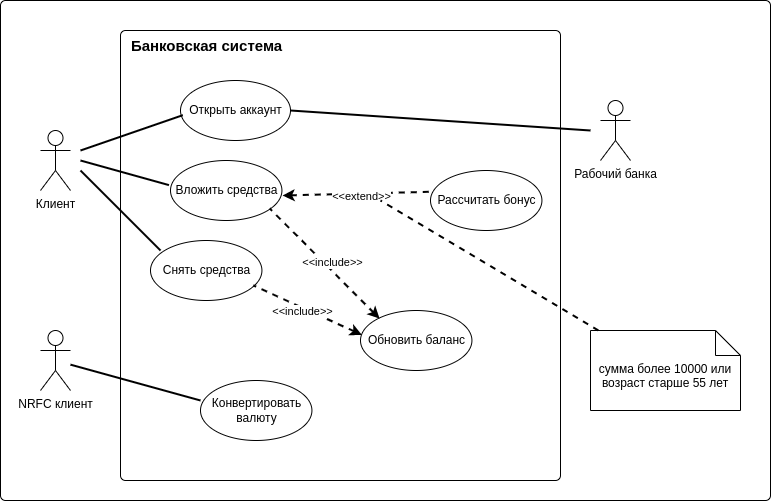

# Диаграмма прецедентов

**Диаграмма прецедентов** – это тип **поведенческой диаграммы** UML, который часто используется для анализа различных систем. Они позволяют визуализировать различные типы ролей в системе и то, как эти роли взаимодействуют с системой. Это руководство по диаграмме вариантов использования охватывает следующие темы и поможет вам лучше создавать сценарии использования.

### Содержание

- [Важность использования диаграммы прецедентов](#важность-использования-диаграммы-прецедентов) 
- [Объекты диаграммы прецедентов](#объекты-диаграммы-прецедентов) 
- [Отношения в диаграммах вариантов использования](#отношения-в-диаграммах-вариантов-использования) 
- [Как создавать диаграммы прецедентов](#как-создавать-диаграммы-прецедентов-использования) 
- [Шаблоны диаграмм прецедентов](#шаблоны-диаграмм-прецедентов)

## Важность использования диаграммы прецедентов

Как уже упоминалось ранее, диаграммы прецедентов используются для сбора требований к использованию системы. В зависимости от ваших требований вы можете использовать эти данные различными способами. Ниже приведены несколько способов их использования.

- Идентификация функций и как с ними взаимодействуют роли – основное назначение диаграмм сценариев использования.
- Для представления системы на высоком уровне – Особенно полезно при представленииее руководителям или заинтересованным сторонам.
- Вы можете выделить роли, которые взаимодействуют с системой, и функциональные возможности, предоставляемые системой, не углубляясь во внутреннюю работу системы.
- Идентификация внутренних и внешних факторов – Это может показаться простым, но в больших сложных проектах система может быть идентифицирована как внешняя роль в другом прецеденте.

## Объекты диаграммы прецедентов

Использовать диаграммы корпуса состоят из 4 объектов.

- [Актор](./actor.md)
- [Прецедент](./use-case.md)
- [Система](./boundary.md)

Также есть необязательные объекты:

- [Комментарий](./comment.md)

## Отношения в диаграммах вариантов использования

Существует четыре типа отношений на диаграмме прецедентов.

- Ассоциация между актором и прецедентом
- Расширить отношения между двумя прецедентами
- Включить взаимосвязь между двумя прецедентами
- Обобщение прецедента и актора

Подробнее об отношениях [здесь](./relationships.md)

## Как создавать диаграммы прецедентов использования

### Выявление акторов

> [Акторы](./actor.md) – это внешние объекты, взаимодействующие с вашей системой. Это может быть человек, другая система или организация. В банковской системе наиболее очевидным действующим лицом является клиент. Другие акторы могут быть банковскими служащими или кассирами в зависимости от роли, которую вы пытаетесь показать в прецедентах. Примером внешней организации может служить налоговый орган или центральный банк. Кредитный процессор является хорошим примером внешней системы, связанной в качестве агента.

### Определение прецедентов

> Теперь пришло время идентифицировать прецеденты. Хороший способ сделать это – определить, что нужно участникам системы. В банковской системе клиенту необходимо будет открывать счета, вводить и выводить средства, запрашивать чековые книги и выполнять аналогичные функции. Так что все это можно рассматривать как прецеденты. Прецеденты верхнего уровня всегда должны обеспечивать полную функцию, требуемую для агента. В зависимости от сложности системы вы можете расширить или включить прецеденты. После того, как вы определили акторов и верхний уровень использования, у вас есть базовое представление о системе. Теперь вы можете точно настроить его и добавить к нему дополнительные слои деталей.

### Ищите общие функциональные возможности для использования `Включать`

> Ищите общие функциональные возможности, которые могут быть повторно использованы в системе. Если вы найдете два или более прецедентов, которые имеют общую функциональность, вы можете извлечь общие функции и добавить его в отдельный прецедент. Затем вы можете подключить его через [include relationship](./relationships.md), чтобы показать, что он всегда вызывается, когда выполняется исходный сценарий использования. ( см. диаграмму для примера ).

### Возможно ли обобщение акторов и прецедентов

> Могут быть случаи, когда агенты ассоциируются с аналогичными прецедентами, в то время как запускается несколько прецедентов, уникальных только для них. В таких случаях можно обобщить агент, чтобы показать наследование функций. Аналогичную вещь можно сделать и в прецеденте. Одним из лучших примеров этого является прецедент “Оплатить” в платежной системе. Вы можете далее обобщить его до “Оплатить кредитной картой”, “Оплатить наличными”, “Оплатить чеком” и т.д. Все они имеют атрибуты и функциональность оплаты со специальными уникальными для них сценариями.

### Необязательные функции или дополнительные функции

> Есть некоторые функции, которые срабатывают опционально. В таких случаях можно использовать отношения расширения и прикрепить к ним правило расширения. В приведенном ниже примере банковской системы “Рассчитать бонус” является необязательным и срабатывает только при выполнении определенного условия. Продление не всегда означает, что оно необязательно. Иногда вариант использования, связанный с удлинением, может дополнять вариант использования базы. Следует помнить, что базовый сценарий использования должен быть способен выполнять функцию самостоятельно, даже если сценарий использования расширения не вызывается.

Графическое изображение диаграммы прецедентов "Банковская система"

## Шаблоны диаграмм прецедентов

Существует сайт с примерами диаграммы прецедентов для распространенных сценариев. Хотя ваша проблема или сценарий не будут в точности такими, вы можете использовать их в качестве отправной точки как для лучшего понимания диаграммы прецедентов, так и для вашей будущей системы. Ознакомьтесь с [шаблонами диаграмм прецедентов](https://creately.com/diagram-community/popular/t/use-case).

[<< На главную](../README.md)

<!-- В главный README -->
<!--

Диаграмма вариантов использования (англ. use-case diagram) – диаграмма, описывающая, какой функционал разрабатываемой программной системы доступен каждой группе пользователей.

На диаграммах вариантов использования отображается взаимодействие между вариантами использования, представляющими функции системы, и действующими лицами, представляющими людей или системы, получающие или передающие информацию в данную систему. Из диаграмм вариантов использования можно получить довольно много информации о системе. Этот тип диаграмм описывает общую функциональность системы. Пользователи, менеджеры проектов, аналитики, разработчики, специалисты по контролю качества и все, кого интересует система в целом, могут, изучая диаграммы вариантов использования, понять, что система должна делать. -->
